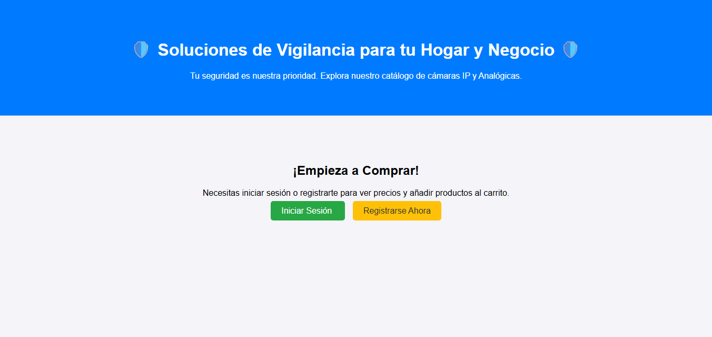
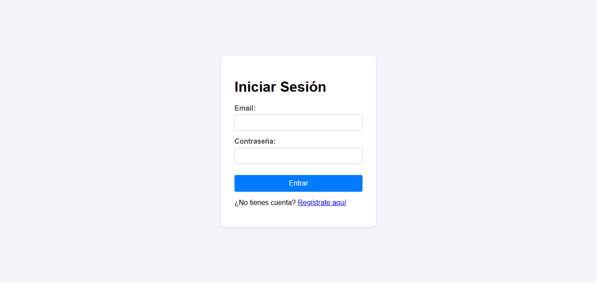
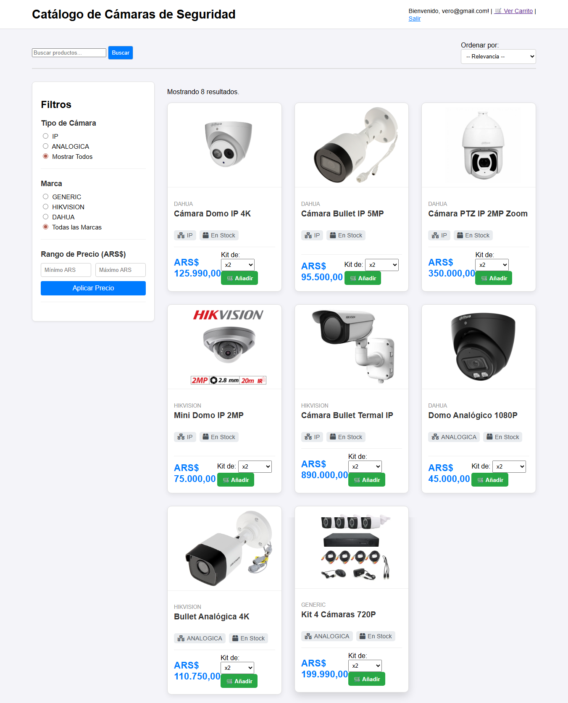
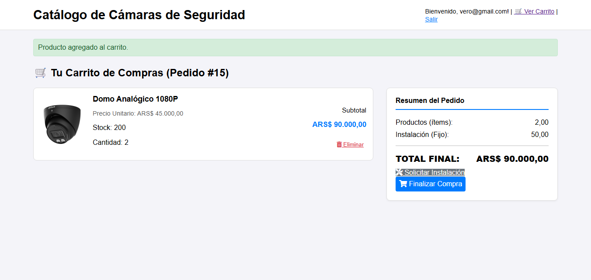
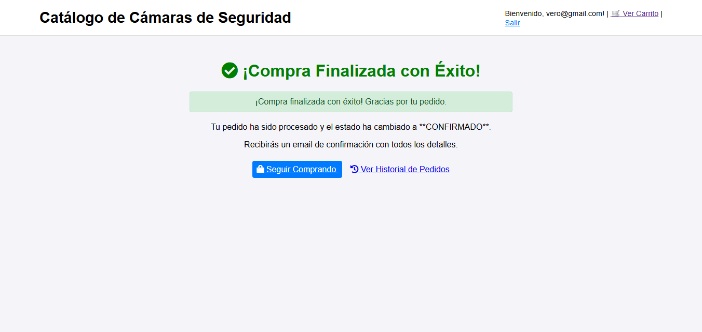

# E-COMMERCE DE SEGURIDAD (Spring Boot & Thymeleaf)

Este proyecto es una aplicación que simula una tienda en línea especializada en la venta e instalación de sistemas de cámaras de seguridad. Implementa un flujo de negocio completo desde la navegación del catálogo hasta la finalización del pedido con servicios asociados.

## VISTAS DEL PROYECTO

Aquí puedes ver el flujo de la aplicación.

| Característica | Captura de Pantalla |
| :--- | :--- |
| Acceso a la Plataforma |  |
| Inicio de Sesión |  |
| Catálogo y Filtros |  |
| Carrito y Resumen |  |
| Programar Instalación |  |
| Confirmación de Compra |  |

## Características Principales

* Catálogo Avanzado:** Permite navegar y filtrar productos de manera **dinámica y persistente**.
* Filtrado Múltiple:** Búsqueda por texto (parcial), precio, marca (GENERIC, HIKVISION, DAHUA), y tipo de cámara (IP/Analógica).
* Servicio de Instalación:** Flujo de *checkout* que permite al usuario añadir el costo de instalación y programar la fecha y hora del servicio.
* Seguridad:** Autenticación de usuarios y control de acceso mediante Spring Security.

## STACK TECNOLÓGICO

| Componente | Tecnología | Notas |
| :--- | :--- | :--- |
| Backend Core | **Java** | 17/21 |
| Framework | **Spring Boot** | 3+ (con Spring Data JPA) |
| Base de Datos | **PostgreSQL** | Usada para persistencia de productos, pedidos y usuarios. |
| Frontend | **Thymeleaf** | Motor de plantillas para renderizado del lado del servidor (SSR). |

## CONFIGURACIÓN E INSTALACIÓN

Para ejecutar este proyecto localmente, asegúrate de tener Java 17+ y una base de datos PostgreSQL.

### 1. Configurar Credenciales

**¡IMPORTANTE!** Por seguridad, no subimos el archivo `application.properties` al repositorio.

* Crea un nuevo archivo llamado `src/main/resources/application.properties`.
* Rellena las credenciales de tu base de datos:

```properties
spring.datasource.url=jdbc:postgresql://localhost:5432/nombre_de_tu_base
spring.datasource.username=tu_usuario
spring.datasource.password=tu_password
spring.jpa.hibernate.ddl-auto=update
# Opcional: Puerto del servidor
server.port=8080